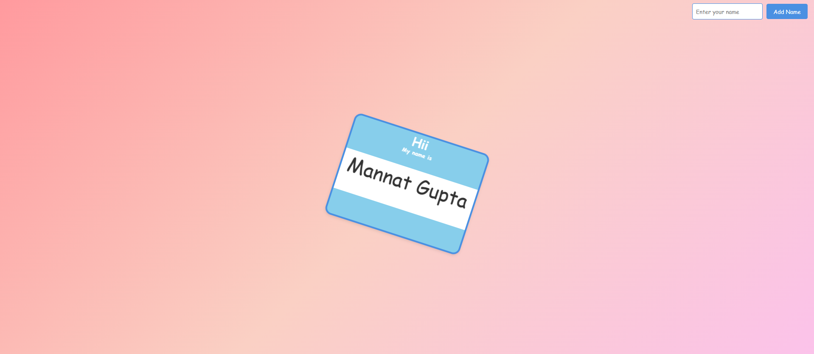
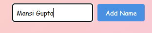
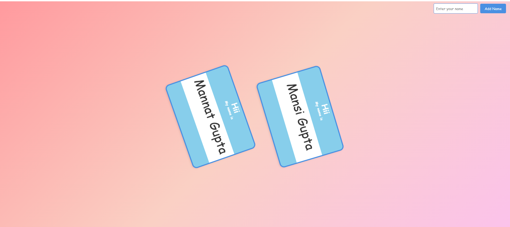

# Name Tag Stickers

This project dynamically generates personalized name tag stickers with attractive animations. Users can input names, and the stickers are displayed with smooth animations and a modern design.

## Features

- **Dynamic Sticker Creation**: Add new stickers in real-time by entering a name.
- **Interactive Animations**: Stickers continuously rotate and respond to hover interactions with smooth transitions.
- **Responsive Design**: Adapts to different screen sizes for an optimal user experience.
- **Customizable Template**: Easily modify styles or layouts in the template for your needs.
- **Minimalist Interface**: Clean and intuitive design with no clutter.

## How It Works

1. **Input Name**: Type a name in the input field at the top-right corner.
2. **Generate Sticker**: Click the "Add Name" button to create your personalized sticker.
3. **Dynamic Display**: Watch as the sticker rotates continuously and appears with fade-in effects.

## Technologies Used

- **HTML**: Structuring the web page and templates.
- **CSS**: Styling the stickers, animations, and overall layout.
- **JavaScript**: Handling user interactions and dynamic sticker generation.

## Screenshots

### Initial Interface  
The main interface showing the input field and button.  

### Adding a Name  
Demonstrates entering a name and clicking the "Add Name" button.  

### After Adding  
Illustrates the dynamically generated sticker on the page.  

## Customization

### Modify Styles
- Open the `style.css` file to customize the look of the stickers, including:
  - Background colors.
  - Font styles.
  - Animations.

### Change Animations
- Adjust the keyframes in `@keyframes continuousRotate` in the `style.css` file for rotation speed or patterns.

## Contributing

Contributions are welcome! If you have ideas for improving the project or fixing issues, feel free to create a pull request or raise an issue.

---

Happy coding!
